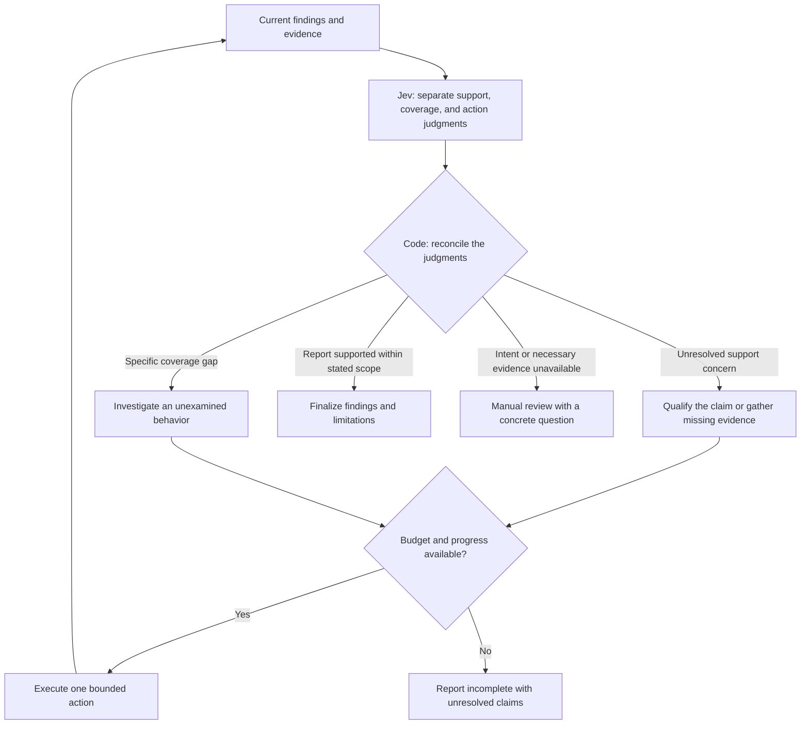

# Open-loop and closed-loop review-controller pilot

Authors: Yoav Shmariahu and Codex. Run: 2026-10-07 UTC (October 6 in Los Angeles).

**Experimental research only. No production review behavior changed.** This pilot tests a small review controller on three reconstructed checkpoints, not a complete coding agent, debugging loop, or deployment candidate.

## What we learned

The initial policy escalated all three cases because action-choice confidence was below 0.6. A second policy allowed low-confidence choices among bounded read-only actions: it verified two reports, then observed the revised evidence and finalized them. It finalized the third report immediately. All known defect mechanisms remained in the outputs, but the skipped verification lost a useful qualification of an impact claim. This is not evidence of an equivalent-quality efficiency improvement.

The next graph revision needs separate treatment of **factual support**, **coverage**, and **action preference**, followed by a code-owned reconciliation gate. A recommendation to finalize must not silently override an unresolved claim-support concern. Whether that concern merits another source read, a narrower report, or human involvement is the next experiment. Neither tested policy is ready to adopt in production.

## Terminology

| Term | Meaning here |
| --- | --- |
| Open-loop replay | Jev judges frozen recorded/reconstructed state; its output does not change execution. |
| Shadow evaluation | Jev observes an independently running live agent without controlling it. **Not performed in this pilot.** |
| Closed-loop evaluation | Jev selects an action, the executor performs it, and Jev observes the resulting state before choosing again. |

The v1 adaptive arm stopped at its first gate, so it exercised the stop path but no action/observation feedback cycle. The v2 AWS and DaemonSet cases exercised actual feedback cycles. The coding executor was a no-tool Sol call supplied bounded code excerpts, not an autonomous repository agent.

## Frozen scenarios and historical evidence

All source comes from the public `kubernetes/autoscaler` repository at base `40889a675092c0939c59160fc5270273db4e0555`, with one historical fix reversed per case in isolated worktrees. GitHub confirmed the repository is public before model execution. No private Thinker source or credentials appear in model request bodies.

| Scenario | Decision being studied | Existing evidence |
| --- | --- | --- |
| A-10349, AWS provider IDs | Preserve a distinct secondary finding; verify scope without losing it | Both missing start-anchor and placeholder slash truncation already appear in the raw archived report. |
| A-10141, DaemonSet replica count | Qualify an asserted downstream recovery failure | Local desired-versus-ready count failure is shown; caller/recovery behavior is not in the initial excerpt. |
| A-10178, checkpoint cleanup | Determine whether further verification adds value | Premature completion timestamp and shared deadline are already reported; actual deletion-client cancellation behavior is absent. |

These checkpoints are deliberately reconstructed from the archived **postprocessed** `findings` fields in `../jev-sol-opus-ten/evidence.tar.gz`, not exact historical pre-verification prompts. `verified` explanations and evaluator probe results are withheld from both models. Secondary `locations` are flattened into individual findings. That transformation is shared by every arm. Explicit contracts are derived from known historical fixes, so these are in-sample development cases. None is a held-out discovery test.

**Historical label discrepancy:** the prior written [verification audit](../jev-sol-opus-ten/thoroughness.md) calls A-10349 a target miss, but its archive's `A-10349.json` includes the target slash-truncation bug in `findings[0].locations[0]`. We used that raw artifact as the scenario input and award no new-discovery credit. We have not retrospectively rescored the earlier study or established when/how its summary diverged.

## Protocol and iteration

[protocol.json](protocol.json) was written before new model calls. Exact scenario bytes are pinned in [inputs.sha256.json](inputs.sha256.json). The three open-loop questions ask about claim support, bounded coverage, and the next action independently, using [TypeSafe Choice](https://docs.typesafe.ai/primitives/choice) and the [current HTTP contract](https://docs.typesafe.ai/api).

Both closed-loop arms start with identical state, available actions, model/effort, and a two-action ceiling. The fixed policy always verifies once, then finalizes. The adaptive policy may verify existing findings, inspect a predeclared caller excerpt, investigate unreported violations in supplied source, finalize, or request manual review. It re-evaluates the updated state after actions. Realized work is allowed to differ; equal ceilings do not imply equal work.

- Routing: **jev-1.13.0**, response model checked on every call.
- Executor: **gpt-6.1-sol, high**, Codex CLI **0.160.1**, explicit invocation, no fallback. The CLI did not echo model identity; this is invocation-level verification, not provider-confirmed identity.
- Grading: manual full-finding/source audit and executable source-extraction probes, no model judge.
- One run per arm; alternated v1 arm order. The later v2 development iteration reuses the same-run fixed controls and is not a randomized independent trial.
- For AWS and DaemonSet, saved first-action executor prompts and CLI arguments are byte-for-byte identical between fixed and v2 arms; the audit checks this. Runtime token counts can still differ.
- Per call: executor 180 seconds, Jev 30 seconds. Per mode invocation: 900 seconds. Each adaptive arm permits at most two executor actions and three Jev decisions. Repeating an identical action with identical findings/source stops as stalled. No outcome-based retries.

**v1:** a universal action-confidence cutoff of 0.6 routed all three states to manual review. Open-loop next-action confidence was 0.36 (AWS), 0.27 (DaemonSet), and 0.42 (cleanup). The DaemonSet distribution split between verification and inspecting callers: uncertainty between potentially useful actions did not establish a need for human intent.

**v2:** [protocol-v2.json](protocol-v2.json) was written after the open-loop observation and before v2 calls. It removes that universal cutoff for this bounded read-only action menu. Factual probabilities remain recorded; no edit, comment publication, or merge authority is granted. This tests a hypothesis about action selection, not a general rule to disregard model uncertainty.

## Results

| Scenario | Fixed verification | Jev v1 | Jev v2 | Manual assessment |
| --- | --- | --- | --- | --- |
| AWS | Verify → finalize | Manual review | Verify → observe → finalize | Both active arms preserve the two existing defects and replace an unsupported deleted-test citation with source evidence. |
| DaemonSet | Verify → finalize | Manual review | Verify → observe → finalize | Both active arms qualify downstream recovery and retain the local defect. Additional examples are the same root cause, not extra discoveries. |
| Cleanup | Verify → finalize | Manual review | Finalize immediately | Known mechanisms remain, but v2 retains a stronger deletion-impact claim than the supplied client evidence establishes. |

On cleanup, v2's simultaneous claim-support answer was `overclaimed` with probability **0.59**, while next action was `finalize` with probability **0.53**. The controller consumed only the action answer. Fixed verification instead changed the claim from “cannot delete orphaned checkpoints” to the directly supported expired-context/reduced-budget behavior and stated that the deletion client was not inspected. Our [manual assessment](assessments.json) counts this lost qualification as a quality regression, even though target-mechanism retention stays unchanged.

| Same-run aggregate | Executor calls | Executor input / output tokens | Jev calls | Jev input / output tokens | Sum of arm elapsed time |
| --- | ---: | ---: | ---: | ---: | ---: |
| Fixed verification | 3 | 54,869 / 1,673 | 0 | 0 / 0 | 58.075 s |
| Jev v1 | 0 | 0 / 0 | 3 | 12,295 / 481 | 0.571 s |
| Jev v2 | 2 | 32,867 / 1,086 | 5 | 17,311 / 797 | 37.927 s |

Executor input includes provider cache reads: 36,864 fixed and 24,576 v2. Do not add cache reads again. Reasoning output is a subset of reported output, not an additional charge. Jev and executor tokens are shown separately, not treated as equivalent units of quality or cost. Times are sequential arm elapsed observations, not a controlled latency estimate. The three separate open-loop calls, invalid attempts, preparation and evaluator probes are excluded from the closed-loop table and retained in artifacts. Escalating without doing work is not a speed win; skipping cleanup qualification is not a free efficiency gain.

## Evidence-based graph revision

The original broad graph remains a hypothesis. This smaller proposed **v3** change is supported by the failure diagnosis but **has not been model-tested**:



The rule for reconciling weak or conflicting semantic judgments still needs design and held-out testing. This diagram intentionally does not invent a calibrated threshold from three cases. Retaining the full finding tree is a deterministic data-integrity requirement and should not consume a Jev call.

## Verification and limitations

[probe.py](probe.py) executes exact extracted upstream mechanisms using stdlib-only Go wrappers/test doubles. Fixed snapshots pass all checks; every reversed snapshot fails its expected behavioral checks. AWS checks malformed prefix, slash preservation, and original ID preservation. DaemonSet checks zero/partial readiness against desired count. Cleanup checks completion timestamps and context lifetime. The cleanup writer is a timing-controlled stub and its deletion client is a stub; these are **not upstream integration tests** and do not establish production cancellation behavior.

Five controller tests pass: unknown actions rejected, low-confidence action policy distinguished, two-action ceiling preserved across action types, identical-state loops stopped, and report finalization distinct from resolving a defect. The repository suite at the pilot revision passed with telemetry disabled: **496 passed, 5 skipped, 0 failed**. The first sandboxed run failed only on prohibited loopback listeners/process inspection; the authorized run passed. Source and scenario hashes, model pins, matching executor prompts, and action limits pass [summarize.mjs](summarize.mjs).

One executor attempt was initially marked invalid because the harness mistook CLI hook-timeout warnings for tool calls. Its complete answer and accounting are preserved under `results/invalid-warning-parser-attempt`; the parser was narrowly corrected to recognize only those warnings, and the attempt was rerun without changing policy. An earlier sandbox DNS failure made no successful model call. An automatic approval review initially misclassified the public-code payload as private repository content; public provenance and the exact payload fields were checked before approval and execution. No workaround was used.

No clean-change controls, no newly discovered bugs, no patch attempts, no live shadow agent, no held-out scenarios, no repetitions, and no production integration were tested. `inspect_callers`, `investigate_remaining`, model unavailability and the global budget path remain unexercised by live calls. This pilot supports further scenario-driven development, not a comprehensive or superior workflow claim.

## Reproduce

Work in an isolated git worktree. Set `THINKER_TEST=1` for preparation, probes, tests and all model runs. Supply an Autoscaler clone through `AUTOSCALER_REPO` if it is not at `/private/tmp/autoscaler-review`. Raw historical reports are included; preparation needs the pinned upstream commits.

Offline verification of the committed run:

```sh
THINKER_TEST=1 THINKER_TELEMETRY=off node research/review-loop-pilot/summarize.mjs
THINKER_TEST=1 THINKER_TELEMETRY=off node --test research/review-loop-pilot/policy.test.mjs
THINKER_TEST=1 THINKER_TELEMETRY=off python3 research/review-loop-pilot/probe.py
```

For a fresh live sample, first preserve the supplied `results/` under a different name in your isolated worktree. The runner refuses to overwrite arm results. Use a personal TypeSafe key through the normal environment or local key file; credentials are never copied into research artifacts. Test mode stays enabled, with an explicit opt-in transport limited to the direct model endpoint; it cannot enroll with the hosted service or send production Thinker telemetry.

```sh
THINKER_TEST=1 THINKER_TELEMETRY=off python3 research/review-loop-pilot/prepare.py
THINKER_TEST=1 THINKER_TELEMETRY=off THINKER_PILOT_LIVE=1 node research/review-loop-pilot/run.mjs open-loop
THINKER_TEST=1 THINKER_TELEMETRY=off THINKER_PILOT_LIVE=1 node research/review-loop-pilot/run.mjs closed-loop
THINKER_TEST=1 THINKER_TELEMETRY=off THINKER_PILOT_LIVE=1 node research/review-loop-pilot/run.mjs closed-loop --policy=v2
```

Reassess fresh outputs manually; committed assessments apply only to the recorded run. Refresh protocol/model identities before a new experiment rather than silently substituting providers or models. Exact v1 harness text is retained as `harness-v1.mjs.txt`, matching the source hash recorded by that run. The current runner supports both policies.
