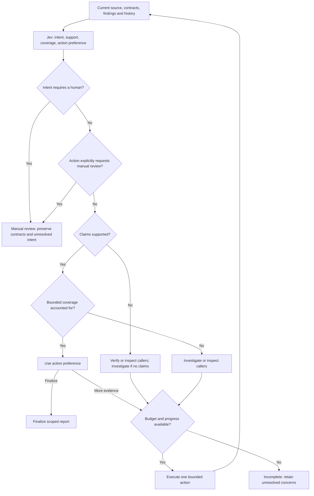

# Review-controller round two: reconcile judgments

Authors: Yoav Shmariahu and Codex. Run: 2026-10-07.

**Experimental research only; no production behavior changed.** The reconciliation gate resolved the conflicting-intent routing failure in both repetitions, left the clean control alone, and still finalized the cleanup overclaim. A deterministic gate can enforce the consequences of Jev's judgments; it cannot repair a mistaken support judgment.

## Protocol and evidence

The [frozen protocol](protocol.json) compares v2 (action preference only) with v3 (intent, support, and coverage constraints before action preference). Both arms use identical questions, inputs, executor instructions, models and limits. [Source and scenario hashes](inputs.sha256.json) plus per-arm hashes record what ran. No prompts or policies were revised after observing outcomes.

- **Open-loop replay:** five frozen states, one Jev call each; the same answers replayed through both policies. No actions executed.
- **Closed-loop evaluation:** five cases × two policies × two repetitions, alternating arm order. Execute an action, update the state, judge again. At most two executor actions and three judgments per arm.
- **Shadow evaluation:** not performed; this would observe an independently running live agent.
- Jev **jev-1.13.0**, provider-returned identity checked; executor **gpt-6.1-sol, high**, Codex CLI **0.160.1**, no fallback. Executor identity is invocation-verified only because the CLI does not echo its resolved model.
- Correctness assessed manually against frozen criteria, with full outputs inspected; implementing agent as evaluator, not blinded, no model judge. [Assessments](assessments.json) are pinned to artifact hashes.

The three development scenarios are byte-identical to the [first pilot](../review-loop-pilot/README.md), reconstructed from public Kubernetes Autoscaler historical review checkpoints. These start with known findings; preservation is not bug discovery. The clean control renames a local identifier in the fixed public AWS parser. The ambiguous control uses the same parser with explicitly contradictory, equally authoritative requirements about slash-containing placeholder names. Neither control is held out or representative of real-world prevalence.

No cache was built or served. Explicit task contracts are scenario inputs, not hand-authored benchmark cache notes; this is not a PR-cache performance comparison. Source provenance and historical-label caveats remain as documented in the first pilot.

Both round-two arms receive a new intent question and an explicit empty-findings instruction for support. Comparing their totals against round one would confound the policy with question changes. The executor receives bounded source in its prompt, cannot use tools, and makes no patches. “Finalize” means finish a review report, not fix a bug or approve a merge.

## Results

Both repetitions had the same routes and criterion outcomes:

| Case | v2 | v3 | Manual assessment |
| --- | --- | --- | --- |
| AWS A-10349 | Verify → finalize | Verify → finalize | Both existing defects retained; unsupported deleted-test citation removed. |
| DaemonSet A-10141 | Verify → finalize | Verify → finalize | Desired-versus-ready behavior retained; downstream recovery impact qualified. Splitting guard and return-value findings earns no extra discovery credit. |
| Cleanup A-10178 | Finalize immediately | Finalize immediately | Both retain the unsupported absolute “cannot delete” impact claim. Known timestamp and shared-deadline mechanisms remain. |
| Clean identifier rename | Finalize immediately | Finalize immediately | No findings invented; no escalation. |
| Conflicting requirements | Investigate → finalize | Manual review immediately | v2 preserves the conflict in limitations but chooses the wrong terminal route. v3 preserves contracts in the handoff state and routes correctly. |

Under the frozen case criteria, **v2 meets 6/10 and v3 meets 8/10**. These are repeated development-case outcomes, not accuracy estimates. The v3 intent result counts correct routing with the conflicting contracts in the archived packet; its short unresolved message is generic. It does not yet generate a concrete human-facing question or obtain a human answer. Neither policy silently chooses one conflicting requirement, and neither invents a bug on that control.

The open-loop intent answer was `needs_human` with probability 1.0 while action preference favored `investigate_remaining` (0.56); the gate applied the human-intent constraint. In cleanup, support instead favored `supported` (0.54) over `overclaimed` (0.45), so neither policy required verification. The prior pilot had classified that claim as overclaimed, but its question set differed. This is a useful development failure, not a controlled claim about model drift. No cutoff was tuned on these results; probabilities are not established calibration evidence.

| Closed-loop total, ten arms each | Executor calls | Executor input / output tokens | Jev calls | Jev input / output tokens | Sum of arm elapsed time |
| --- | ---: | ---: | ---: | ---: | ---: |
| v2 | 6 | 99,924 / 2,885 | 16 | 49,521 / 3,066 | 114.312 s |
| v3 | 4 | 65,734 / 2,144 | 14 | 44,867 / 2,682 | 78.816 s |

The two avoided executor calls are on the intentional human-escalation control. This does not establish general efficiency or successful task completion: the human work remains undone. Executor input includes cached reads (73,728 v2; 49,152 v3); do not add them again. Reasoning output is a subset of output (836 v2; 477 v3). Provider token counts remain separate. Times are sequential observations, not controlled latency estimates. Open-loop's five calls (17,086 input / 959 output tokens), preparation and probes are excluded from this table. All 20 arms were valid; there were no invalid attempts or outcome-based retries in this round.

## Graph status after this round



The intent branch has a positive engineered-control result. The support/coverage reconciliation branches pass deterministic tests but were not causally exercised by a differing live route here: both policies already chose verification for AWS/DaemonSet, while cleanup was judged supported. Budget and stall paths have unit coverage, not live stress evidence. `inspect_callers` was never selected. Therefore this round does not validate every graph edge.

Next proposed experiment, **not implemented or run**: give each material impact claim an explicit evidence status and missing-evidence reference. Distinguish the observed local mechanism from downstream consequences; a report must narrow or retain uncertainty for claims whose required evidence is absent. Test missing-client, available-client, misleading-client and clean controls before adopting that gate. Also require a concrete human question naming the conflicting requirements. Freeze the new policy before evaluating fresh cases; keep these five as development regressions.

## Checks and reproduction

Eight controller unit tests pass. [Offline audit](summarize.mjs) passes source/scenario pins, exact state transitions and decisions, action ceilings, model/effort invocation pins, and byte-identical first-action prompts for matched arms that execute. The source-extraction [probe](probe.py) confirms the clean change is identifier-only and passes malformed-ID rejection, slash preservation, original-ID preservation and ordinary-ID acceptance. These are stdlib Go wrappers, not upstream integration tests or an oracle for human intent. The first pilot's historical-mechanism probes were not rerun.

Repository suite: **497 passed, 5 skipped, 0 failed**, with telemetry disabled. CLI hook-timeout warnings are recorded and narrowly recognized; no executor tools ran. Every experimental process used `THINKER_TEST=1`, production telemetry off, logging off, and automatic learning off. Jev calls used explicit opt-in transport to the direct TypeSafe endpoint with public source payloads and a personal key; credentials are absent from artifacts.

Run in an isolated worktree:

```sh
export THINKER_TEST=1 THINKER_TELEMETRY=off THINKER_LOG=off THINKER_NO_LEARN=1
node research/review-loop-round2/summarize.mjs
node --test research/review-loop-round2/policy.test.mjs
python3 research/review-loop-round2/probe.py
```

To make a fresh model sample, preserve the archived `results/` elsewhere first; preparation uses committed first-pilot fixtures and no upstream checkout is needed. Set the same exact model versions or declare a new cohort. The runner refuses to overwrite open-loop output and only resumes hash-matching valid closed-loop checkpoints. Reassess new outputs; the saved assessment hashes deliberately reject them.

```sh
python3 research/review-loop-round2/prepare.py
THINKER_PILOT_LIVE=1 node research/review-loop-round2/run.mjs open-loop
THINKER_PILOT_LIVE=1 node research/review-loop-round2/run.mjs closed-loop
```

Five chosen cases and two repetitions cannot establish comprehensiveness, calibration, robustness to tool/model failure, or production readiness. No live repository agent, patch loop, human response, or deployment was tested.
